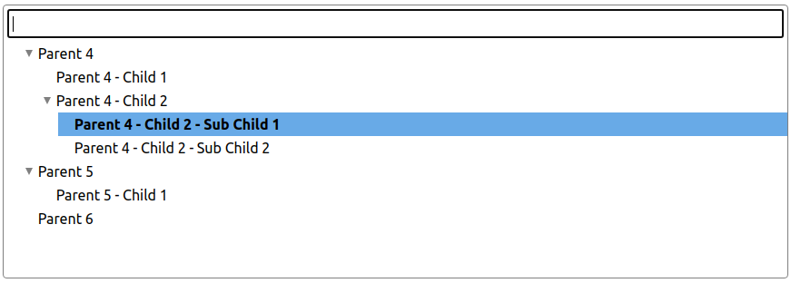

# Tree mode

<p align="center">
  
</p>

## Features

In addition to the general, self-explanatory features, this mode also offers support for the following options:

### Checkboxes

The checkbox-feature is disabled by default. Then only one item can be selected. Checkboxes enable support for multi-selections.

```js
checkboxes: {
    active: true
}
```

All items are now selectable completely independent from each other. So selections of parent-nodes have no effect to their childs. This can be changed, when enabling
[recursive-selection](interfaces/baseoptions.md#checkboxes):

```js
checkboxes: {
    active: true,
    recursive: true
}
```

With recursion enabled, a parent automatically select its childs. A parent is only selected, if all childs are selected too. If the state of one child changes,
the parent is deselected too.


## Live demo

Try this [JSFiddle](https://jsfiddle.net/zn1qwjb9/4/).
